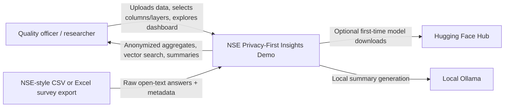
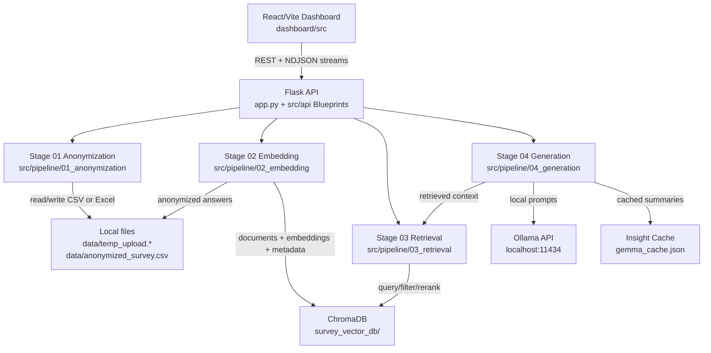

# NSE Privacy-First Insights Demo

This project is a local-first dashboard for turning open-text NSE-style survey answers into anonymized, searchable, and summarized insights.

The core data flow is:

1. Upload a CSV or Excel survey export.
2. Inspect columns and select questionnaire text fields.
3. Anonymize selected text using layered privacy filters.
4. Embed anonymized answers into a local Chroma vector database.
5. Retrieve, rerank, and generate thematic insights with local LLMs.

The project is built for demos and applied research, not production deployment.

## Quick Start

### Backend

macOS/Linux:

```bash
cd /path/to/Demo
python -m venv .venv
source .venv/bin/activate
pip install -r requirements.txt
python app.py
```

Windows PowerShell:

```powershell
cd C:\fontys\semester_4\group\Demo
python -m venv .venv
.\.venv\Scripts\Activate.ps1
pip install -r requirements.txt
python app.py
```

Backend runs on `http://127.0.0.1:5001`.

### Frontend

```bash
cd dashboard
npm install
npm run dev
```

Vite usually runs on `http://localhost:5173`.

## Environment

Create `.env` in the project root when you need Hugging Face downloads:

```env
HF_TOKEN=your_huggingface_token
```

`.env` is gitignored. Keep real tokens out of commits.

Useful optional variables:

```env
ANONYMIZE_BATCH_SIZE=512
MODEL_DEVICE=mps
PYTORCH_ENABLE_MPS_FALLBACK=1
LAYER2_FP16=1
DISABLE_SPACY_MODEL_AUTO_INSTALL=1
RERANKER_ENABLED=true
RERANKER_MODEL=zeroentropy/zerank-2-reranker
RERANKER_CANDIDATE_MULTIPLIER=5
RERANKER_MAX_CANDIDATES=100
LLM_CONTEXT_DOCUMENTS=100
```

`MODEL_DEVICE=auto` prefers CUDA, then Apple MPS, then CPU. On a Mac, set `MODEL_DEVICE=mps` to force the PyTorch-backed anonymization layer onto the Apple GPU. Presidio/spaCy still runs on CPU; the EU-PII / Transformer layer is the part that can use MPS.

## Architecture

`app.py` is intentionally tiny. It must stay below 30 lines and only create the Flask app, enable CORS, and register Blueprints.

Application logic is split by pipeline stage:

```text
src/
├── api/
│   ├── anonymize_routes.py       # HTTP routes for upload, inspection, anonymization, reports
│   ├── vector_routes.py          # HTTP routes for vector build, search, stats, filters
│   └── insight_routes.py         # HTTP routes for summaries, cache, precompute
├── config/
│   ├── paths.py                  # Runtime file paths
│   ├── runtime.py                # .env loading and process env defaults
│   ├── settings.py               # Reranker, context, cache settings
│   └── themes.py                 # Theme definitions and metadata aliases
├── pipeline/
│   ├── 01_anonymization/
│   │   ├── engine.py             # Privacy masking engine
│   │   ├── service.py            # Stage 01 orchestration for API use
│   │   ├── checkpoints.py        # Anonymization resume checkpoint persistence
│   │   └── reporting.py          # Anonymization report writer
│   ├── 02_embedding/
│   │   ├── vector_builder.py     # Embedding and Chroma population
│   │   └── service.py            # Stage 02 orchestration for API use
│   ├── 03_retrieval/
│   │   ├── service.py            # Vector search, filters, reranking, theme distribution
│   │   └── query_cli.py          # CLI helper for local vector search
│   └── 04_generation/
│       ├── service.py            # Insight generation orchestration
│       ├── llm_clients.py        # Ollama client and llama.cpp provider interface
│       ├── prompts.py            # Prompt construction and JSON parsing
│       ├── cache.py              # Insight cache policy
│       └── insight_metrics.py    # Subtheme mention metrics
└── utils/
    └── file_parsers.py           # CSV/Excel loading, delimiter detection, previews
```

Root-level `anonymizer.py`, `vector_builder.py`, and `queryVectorDB.py` are compatibility shims. New code should import from `src/pipeline/...` or `src/api/...`.

## C4 Model

### Level 1: System Context



### Level 2: Containers



### Level 3: Pipeline Flow

```mermaid
flowchart LR
    upload["Upload CSV/Excel"]
    inspect["Inspect columns\nDetect separator"]
    select["Select questionnaire columns\nand privacy layers"]
    anon["Stage 01\nAnonymization"]
    csv["data/anonymized_survey.csv"]
    embed["Stage 02\nEmbeddings"]
    db["ChromaDB collection\nsurvey_responses"]
    retrieve["Stage 03\nSearch + rerank"]
    generate["Stage 04\nPrompt + local LLM"]
    dashboard["Dashboard filters\nquery + theme cards"]

    upload --> inspect --> select --> anon --> csv --> embed --> db
    db --> retrieve --> generate --> dashboard
    retrieve --> dashboard
```



## Current Data Flow

### 1. Upload And Inspect

Endpoint: `POST /api/inspect-file`

Module ownership:

- API route: `src/api/anonymize_routes.py`
- Stage service: `src/pipeline/01_anonymization/service.py`
- Shared parser helpers: `src/utils/file_parsers.py`

Behavior:

- Saves upload to `data/temp_upload.*`.
- Supports `.csv`, `.xlsx`, and `.xls`.
- Detects CSV separator: comma, semicolon, or tab.
- Returns columns and a first-row preview.
- The frontend auto-selects questionnaire columns, including headers with `?`, `Wil jij...`, `Waarom...`, or `Wat voor soort...`.

### 2. Anonymize

Endpoint: `POST /api/anonymize`

Module ownership:

- API route: `src/api/anonymize_routes.py`
- Stage service: `src/pipeline/01_anonymization/service.py`
- Masking engine: `src/pipeline/01_anonymization/engine.py`
- Checkpoints: `src/pipeline/01_anonymization/checkpoints.py`
- Reports: `src/pipeline/01_anonymization/reporting.py`
- Core privacy layers: `src/core/layers/`

Current layer options:

- `presidio`: spaCy NL/EN + Presidio + custom recognizers.
- `eu-pii`: `tabularisai/eu-pii-safeguard`.
- `openai-privacy-filter`: experimental optional Hugging Face model.

Important behavior:

- Selected layers are preflighted before processing.
- If a selected model cannot load, the backend returns an error instead of silently skipping it.
- Layer spans are collected, merged, filtered, and applied once.
- Output is written to `data/anonymized_survey.csv`.
- Progress is streamed as NDJSON.
- Resume checkpoints are written under `data/`.

Related endpoints:

- `GET /api/inspect-anonymized`
- `POST /api/run-anonymize-check`
- `GET /api/anonymize-report`
- `GET /api/checkpoint-status`

### 3. Build Vectors

Endpoint: `POST /api/build-vectors`

Module ownership:

- API route: `src/api/vector_routes.py`
- Stage service: `src/pipeline/02_embedding/service.py`
- Vector builder: `src/pipeline/02_embedding/vector_builder.py`
- Static metadata aliases: `src/config/themes.py`

Behavior:

- Reads `data/anonymized_survey.csv`.
- Uses selected questionnaire columns.
- Stores documents, embeddings, and metadata in ChromaDB.
- Loads the embedding model before deleting/recreating the Chroma collection.
- Supports `Octen/Octen-Embedding-0.6B` by default, plus `Octen/Octen-Embedding-4B` and `Octen/Octen-Embedding-8B`.
- Stores the selected embedding model in Chroma metadata so later queries use matching vector dimensions.
- Supports `allow_model_download` from the frontend.
- Streams progress as NDJSON.

Metadata is normalized to stable dashboard keys:

- `institution`
- `academic_year`
- `location`
- `programme`
- `study_mode`
- `cohort`

NSE/RIO aliases such as `Jaar`, `Leerroute_Track`, `Type Student`, and `Actuele naam instelling volgens RIO` are mapped into these keys.

Related endpoint:

- `GET /api/vector-checkpoint-status`

### 4. Retrieve And Query

Endpoints:

- `GET /api/filter-options`
- `GET /api/query-vectors`
- `GET /api/vector-stats`

Module ownership:

- API route: `src/api/vector_routes.py`
- Stage service: `src/pipeline/03_retrieval/service.py`

Behavior:

- Reads Chroma metadata for dashboard filter options.
- Builds metadata filters using canonical keys and known aliases.
- Embeds search queries with the same embedding model stored in the Chroma collection.
- Retrieves broad candidates from Chroma.
- Uses `zeroentropy/zerank-2-reranker` by default to rerank candidates.
- Computes theme distribution from the closest hardcoded theme embedding.
- Caches filtered theme overview frequency results in memory.

### 5. Generate Insights

Endpoints:

- `POST /api/precompute-insights`
- `POST /api/theme-summary`
- `POST /api/clear-cache`
- `GET /api/themes-overview`

Module ownership:

- API route: `src/api/insight_routes.py`
- Stage service: `src/pipeline/04_generation/service.py`
- Local LLM clients: `src/pipeline/04_generation/llm_clients.py`
- Prompt construction: `src/pipeline/04_generation/prompts.py`
- Cache policy: `src/pipeline/04_generation/cache.py`
- Subtheme metrics: `src/pipeline/04_generation/insight_metrics.py`

Behavior:

- Uses local Ollama at `http://localhost:11434`.
- Checks Ollama availability and selected model before generation.
- If the model is missing, generation fails unless model download is enabled in the UI.
- Retrieves and reranks context before building the prompt.
- Sends up to `LLM_CONTEXT_DOCUMENTS` reranked answers to the LLM. The default is `100`.
- Successful summaries are cached in `gemma_cache.json`.
- Failed generations are not cached as successful insights.
- `/api/themes-overview` returns cached insight cards and uses Stage 03 retrieval for filtered theme frequencies.

`src/pipeline/04_generation/llm_clients.py` contains the provider abstraction. Ollama is implemented; llama.cpp has a placeholder client so the API routes do not need to change when llama.cpp support is added.

## API Route Map

```text
Stage 01 anonymization:
POST /api/inspect-file
POST /api/anonymize
GET  /api/inspect-anonymized
POST /api/run-anonymize-check
GET  /api/anonymize-report
GET  /api/checkpoint-status

Stage 02 embedding:
POST /api/build-vectors
GET  /api/vector-checkpoint-status
GET  /api/status

Stage 03 retrieval:
GET  /api/filter-options
GET  /api/query-vectors
GET  /api/vector-stats

Stage 04 generation:
POST /api/theme-summary
POST /api/precompute-insights
POST /api/clear-cache
GET  /api/themes-overview
```

## Key Files

```text
app.py                                      Thin Flask app factory and Blueprint registration
src/api/*.py                               Flask Blueprints only
src/config/*.py                            Static paths, themes, settings, runtime env setup
src/utils/file_parsers.py                  CSV/Excel parsing helpers
src/pipeline/01_anonymization/             Upload inspection, anonymization, reports, checkpoints
src/pipeline/02_embedding/                 Embeddings and Chroma population
src/pipeline/03_retrieval/                 Vector search, filters, reranking, theme distribution
src/pipeline/04_generation/                LLM clients, prompts, cache, insight orchestration
src/core/layers/privacy_pipeline.py         Late-mask span pipeline
src/core/layers/layer1_presidio.py          Presidio + spaCy + custom regex
src/core/layers/layer2_eu_pii.py            EU-PII Hugging Face layer
src/core/layers/layer2_openai_privacy_filter.py
dashboard/src/pages/PipelineDemo.jsx        Pipeline UI shell
dashboard/src/components/AnonymizerTab.jsx  Upload, column and layer selection
dashboard/src/components/VectorDBBuilder.jsx
dashboard/src/components/InsightGenerator.jsx
dashboard/src/components/QueryTab.jsx
dashboard/src/pages/Overview.jsx            Dashboard filters and themes
```

## Generated Local Files

These are runtime artifacts and should not be committed:

```text
data/temp_upload.*
data/anonymized_survey.csv
data/detected_sep.txt
data/anon_checkpoint.csv
data/anon_checkpoint_meta.json
data/anonymization_report.txt
data/anonymization_report.json
data/vector_checkpoint.json
survey_vector_db/
gemma_cache.json
__pycache__/
```

## Contributor Notes

- Keep application logic out of `app.py`.
- Keep HTTP concerns in `src/api`.
- Keep data-flow logic in the matching `src/pipeline/*` stage.
- Keep static constants, theme definitions, path definitions, and env defaults in `src/config`.
- Keep shared parsers and small helpers in `src/utils`.
- Do not commit `.env`, generated CSVs, ChromaDB files, reports, checkpoints, or model cache files.
- If you add llama.cpp support, implement it behind `src/pipeline/04_generation/llm_clients.py` so API routes remain unchanged.
- If you add Hierarchical RAG, put retrieval strategy code behind `src/pipeline/03_retrieval` so API routes remain unchanged.
- If you change metadata handling, keep canonical dashboard keys stable: `institution`, `academic_year`, `location`, `programme`, `study_mode`, `cohort`.

## Common Issues

### Model Downloads Are Slow

First runs may download Hugging Face or Ollama models. Add `HF_TOKEN` for better Hugging Face rate limits.

### Flask Loads Twice

`app.py` runs Flask with `use_reloader=False` to avoid loading model stacks twice. If you use the Flask CLI manually, also disable the reloader:

```bash
flask --app app run --port 5001 --no-reload
```

### Filters Are Empty

Rebuild the vector database after changing metadata mappings. Filter options come from Chroma metadata.

### Insight Generation Fails

Check Ollama:

```bash
ollama list
ollama pull gemma4:e4b
```

Or enable model download in the UI.
