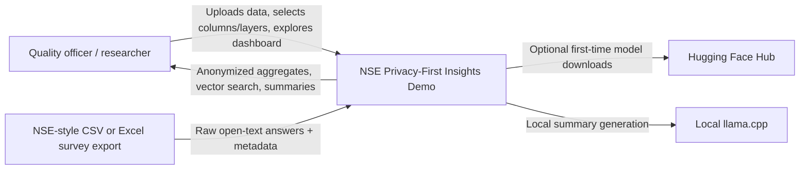

# NSE Privacy-First Insights Demo

This project is a local-first dashboard for turning open-text NSE-style survey answers into anonymized, searchable, and summarized insights.

The core data flow is:

1. Upload a CSV or Excel survey export.
2. Inspect columns and select questionnaire text fields.
3. Anonymize selected text using layered privacy filters.
4. Embed anonymized answers into a local Chroma vector database.
5. Retrieve, rerank, and generate thematic insights with local LLMs.

The project is built for demos and applied research, not production deployment.

## Quick Start

### Backend

Use Python 3.12 for the backend on MAC. Python 3.14 is too new for some of the
NLP dependencies in `requirements.txt` and may try to compile packages such as
`thinc-apple-ops` from source.

macOS/Linux:

```bash
cd /path/to/Demo
python3.12 -m venv .venv
source .venv/bin/activate
python -m pip install -r requirements.txt
python app.py
```

AMD ROCm users should install the matching ROCm PyTorch build first and use
`requirements-amd.txt` instead, as described under PyTorch GPU acceleration.

Windows PowerShell:

```powershell
cd C:\fontys\semester_4\group\Demo
python -m venv .venv
.\.venv\Scripts\Activate.ps1
pip install -r requirements.txt
python app.py
```

Backend runs on `http://127.0.0.1:5001`.

### Frontend

```bash
cd dashboard
npm install
npm run dev
```

Vite usually runs on `http://localhost:5173`.

### llama.cpp (Required for Insights)

The generation stage uses `llama-server` for local LLM inference. The app can start and stop the server automatically — you do not need to run it manually.

#### macOS

```bash
brew install llama.cpp
```
tail -f logs/llama-server.log
#### Linux

```bash
git clone https://github.com/ggerganov/llama.cpp
cd llama.cpp
make
# Add the build output directory to your PATH
```

#### Windows (Build from Source with CUDA) USE TERMINAL

To build `llama.cpp` from source with GPU support on Windows, you must have the **NVIDIA CUDA Toolkit**, **Visual Studio C++ Build Tools**, and **CMake** installed.

1. **Install CMake** (if not already installed):
   Open PowerShell and run:
   ```powershell
   winget install --id Kitware.CMake -e --source winget
   ```
   *Restart your PowerShell/terminal after installing.*

2. **Install Nvidia CUDA toolkit** (if not already installed):
https://developer.nvidia.com/cuda-downloads?target_os=Windows

3. **Clone the repository and build llama.cpp**

1: Run the below command to clone the official repository or alternatively get it from the download page.

git clone https://github.com/ggerganov/llama.cpp
cd llama.cpp
2: Now build llama.cpp:

mkdir build
cd build

cmake -B build -DGGML_CUDA=ON
cmake --build build --config Release
Once the build has completed, you will find your executable files usually in:

.\build\bin\Release\
   *This compiles `llama-server.exe` into the `build\bin\Release` directory.*

5. **Configure your environment**:
   Since you cloned it inside the project, point your `.env` file to the compiled binary inside the `llama.cpp` folder and set the GPU layers:
   ```env
   LLAMA_CPP_SERVER_BIN=llama.cpp\build\bin\Release\llama-server.exe
   LLAMA_CPP_N_GPU_LAYERS=99
   ```
6. **Unified Memory**
The environment variable GGML_CUDA_ENABLE_UNIFIED_MEMORY=1 can be used to enable unified memory in Linux. This allows swapping to system RAM instead of crashing when the GPU VRAM is exhausted. In Windows this setting is available in the NVIDIA control panel as System Memory Fallback.
#### Verify the installation

After installing, run:

```bash
llama-server --version
```

If the version prints correctly, start the server once manually to trigger the model download:

```bash
llama-server -hf unsloth/gemma-4-E4B-it-GGUF:UD-Q4_K_XL -c 32000 -ngl 99
```

Wait until the server prints `listening`, then close it. After that the app can manage the server automatically.

If `llama-server --version` gives an error, restart your computer and try the commands above again.

#### Enabling GPU on Windows (NVIDIA)

Set `LLAMA_CPP_N_GPU_LAYERS=99` in your `.env` so the app offloads all layers to the GPU when it auto-starts the server:

```env
LLAMA_CPP_N_GPU_LAYERS=99
```

Without this the server runs on CPU only. With an RTX 4050 (6 GB VRAM) and the default E4B model (~5 GB), all layers fit in VRAM and generation runs at ~30 tokens/second instead of ~5 tokens/second on CPU.

To verify the GPU is being used, check the llama-server startup log for a line like:

```
I device_info:
I   - CUDA0   : NVIDIA GeForce RTX 4050 ...
```

If only `CPU` appears, the CUDA DLLs are missing (see step 2 above).

#### Optional: point to a specific binary

If `llama-server` is not on your PATH, set `LLAMA_CPP_SERVER_BIN` in your `.env`:

```env
LLAMA_CPP_SERVER_BIN=C:\tools\llama.cpp\llama-server.exe
```

#### How the app starts the server

When you click **Generate Insights** in the UI with **"Start llama-server if needed"** enabled, the app will:

1. Check that `llama-server` is on your PATH (or at `LLAMA_CPP_SERVER_BIN`).
2. Launch `llama-server -hf unsloth/gemma-4-E4B-it-GGUF:UD-Q4_K_XL -c 32000 -ngl 99` (with `-ngl` if `LLAMA_CPP_N_GPU_LAYERS` is set).
3. On first run, llama-server downloads the model (~5 GB) from Hugging Face automatically.
4. After startup it connects on `http://127.0.0.1:8080` (configurable via `LLAMA_CPP_BASE_URL`).
5. After generation it shuts down the server and unloads the model.

To run the server manually instead, start it before clicking Generate and leave the checkbox unchecked:

```powershell
llama-server -hf unsloth/gemma-4-E4B-it-GGUF:UD-Q4_K_XL -c 32000 -ngl 99
```

### PyTorch GPU acceleration

The EU-PII anonymization layer, embeddings, and reranker use PyTorch through the shared `MODEL_DEVICE` router.

- **NVIDIA CUDA:** install a PyTorch CUDA wheel matching the host driver/runtime. `MODEL_DEVICE=auto` or `MODEL_DEVICE=cuda` selects it.
- **AMD ROCm/HIP:** install the ROCm-enabled PyTorch build listed for your exact OS and GPU in AMD's [current PyTorch compatibility documentation](https://rocm.docs.amd.com/en/latest/compatibility/ml-compatibility/pytorch-compatibility.html). Then use `MODEL_DEVICE=auto` or `MODEL_DEVICE=rocm`.
- **Apple Silicon:** the standard macOS PyTorch wheel includes MPS. Use `MODEL_DEVICE=mps`.

PyTorch intentionally exposes AMD ROCm devices through `torch.cuda`, so the application still passes the device string `cuda` to Transformers and SentenceTransformers. No model or anonymization logic changes are required.

Verify an AMD installation before starting the backend:

```bash
python -c "import torch; print('available=', torch.cuda.is_available(), 'hip=', torch.version.hip, 'device=', torch.cuda.get_device_name(0) if torch.cuda.is_available() else None)"
```

The output must show `available=True`, a non-empty `hip=` version, and the AMD GPU name. The backend log will then identify `AMD GPU (ROCm/HIP ... via cuda:0)`.

AMD support depends on AMD's current compatibility matrix. On Windows, only the combinations in AMD's [Windows support matrix](https://rocm.docs.amd.com/projects/radeon-ryzen/en/latest/docs/compatibility/compatibilityrad/windows/windows_compatibility.html) are supported.

In a fresh virtual environment, install AMD's ROCm-enabled PyTorch build first using the command for the exact GPU and OS. Then install the application dependencies without the NVIDIA-only packages:

```bash
python -m pip install -r requirements-amd.txt
```

Installing PyTorch first is important because `sentence-transformers` also depends on it. The ROCm build then satisfies that dependency instead of pip selecting a generic build.

### Presidio (Layer 1) acceleration

Layer 1 uses spaCy and follows the same `MODEL_DEVICE` setting as the rest of the pipeline:

- **NVIDIA CUDA (Windows/Linux):** `cupy-cuda12x` plus the self-contained NVIDIA CUDA 12.x runtime DLL wheels (`nvidia-cuda-nvrtc-cu12`, `nvidia-cuda-runtime-cu12`, `nvidia-cublas-cu12`) are pinned in `requirements.txt`. The DLL wheels add ~660 MB to a fresh install but make GPU activation reliable even when no system CUDA Toolkit is present or `CUDA_PATH` is unset.
- **Apple Silicon (macOS):** `thinc-apple-ops` is installed automatically.
- **AMD ROCm/HIP:** the default spaCy installation does not provide a dependable packaged ROCm backend. Presidio therefore runs on CPU while the PyTorch-backed EU-PII layer runs on the AMD GPU. This fallback does not disable AMD acceleration for the rest of the pipeline.

On NVIDIA, look for `Presidio spaCy running on NVIDIA GPU (CUDA via cuda:0)` in the server logs. If spaCy cannot activate CUDA, re-run `pip install -r requirements.txt` and restart the Flask backend. On AMD, a Presidio CPU fallback is expected unless a compatible ROCm CuPy build was installed separately.

### llama.cpp on AMD

Generation uses an external `llama-server`, independent of `MODEL_DEVICE`. Build the included `llama.cpp` checkout with its HIP backend:

```bash
cd llama.cpp
cmake -S . -B build -DGGML_HIP=ON -DCMAKE_BUILD_TYPE=Release
cmake --build build --config Release
```

Set `LLAMA_CPP_SERVER_BIN` to the resulting `llama-server` and keep `LLAMA_CPP_N_GPU_LAYERS=99`. For unsupported ROCm configurations, llama.cpp also provides a Vulkan backend using `-DGGML_VULKAN=ON`.

## Environment

Create `.env` in the project root when you need Hugging Face downloads:

```env
HF_TOKEN=your_huggingface_token
```

`.env` is gitignored. Keep real tokens out of commits.

Useful optional variables:

```env
ANONYMIZE_BATCH_SIZE=512
MODEL_DEVICE=auto
PYTORCH_ENABLE_MPS_FALLBACK=1
LAYER2_FP16=1
DISABLE_SPACY_MODEL_AUTO_INSTALL=1
RERANKER_ENABLED=true
RERANKER_MODEL=zeroentropy/zerank-2-reranker
RERANKER_CANDIDATE_MULTIPLIER=5
RERANKER_MAX_CANDIDATES=100
LLM_CONTEXT_DOCUMENTS=100
HIERARCHICAL_RAG_BATCH_DOCUMENTS=60
HIERARCHICAL_RAG_MAX_DOCUMENTS=0
DEFAULT_LLM_PROVIDER=llama.cpp
DEFAULT_LLM_MODEL=unsloth/gemma-4-E4B-it-GGUF:UD-Q4_K_XL
LLAMA_CPP_BASE_URL=http://127.0.0.1:8080
LLAMA_CPP_API_KEY=no-key
LLAMA_CPP_SERVER_BIN=C:\tools\llama.cpp\llama-server.exe
LLAMA_CPP_N_GPU_LAYERS=99
```

For theme insight generation, the important hierarchical RAG limit is
`HIERARCHICAL_RAG_BATCH_DOCUMENTS`. The default is `60`, so each map-step
small summary reads up to 60 answers. `RERANKER_MAX_CANDIDATES` still exists,
but it applies to ad-hoc vector query/reranking endpoints, not to the number of
answers analyzed for a theme insight. `LLM_CONTEXT_DOCUMENTS` is retained for
legacy/single-prompt compatibility and cache invalidation; it is no longer the
main cap for hierarchical theme summaries.

`MODEL_DEVICE=auto` prefers an available PyTorch CUDA/ROCm device, then Apple MPS, then CPU. Use `MODEL_DEVICE=rocm` to require an AMD ROCm PyTorch build or `MODEL_DEVICE=mps` to force Apple MPS. Presidio/spaCy may use a different backend from the PyTorch EU-PII layer as described above.

llama.cpp generation tuning is model-specific and lives in `src/pipeline/04_generation/llama_cpp_models.py`.

## Architecture

`app.py` is intentionally tiny. It must stay below 30 lines and only create the Flask app, enable CORS, and register Blueprints.

Application logic is split by pipeline stage:

```text
src/
├── api/
│   ├── anonymize_routes.py       # HTTP routes for upload, inspection, anonymization, reports
│   ├── vector_routes.py          # HTTP routes for vector build, search, stats, filters
│   └── insight_routes.py         # HTTP routes for summaries, cache, precompute
├── config/
│   ├── paths.py                  # Runtime file paths
│   ├── runtime.py                # .env loading and process env defaults
│   ├── settings.py               # Reranker, context, cache settings
│   └── themes.py                 # Theme definitions and metadata aliases
├── pipeline/
│   ├── 01_anonymization/
│   │   ├── engine.py             # Privacy masking engine
│   │   ├── service.py            # Stage 01 orchestration for API use
│   │   ├── checkpoints.py        # Anonymization resume checkpoint persistence
│   │   └── reporting.py          # Anonymization report writer
│   ├── 02_embedding/
│   │   ├── vector_builder.py     # Embedding and Chroma population
│   │   └── service.py            # Stage 02 orchestration for API use
│   ├── 03_retrieval/
│   │   ├── service.py            # Vector search, filters, reranking, theme distribution
│   │   └── query_cli.py          # CLI helper for local vector search
│   └── 04_generation/
│       ├── service.py            # Insight generation orchestration
│       ├── llm_clients.py        # Local LLM runtime clients
│       ├── llama_cpp_models.py   # llama.cpp Gemma GGUF model registry
│       ├── prompts.py            # Prompt construction and JSON parsing
│       ├── cache.py              # Insight cache policy
│       └── insight_metrics.py    # Subtheme mention metrics
└── utils/
    └── file_parsers.py           # CSV/Excel loading, delimiter detection, previews
```

Root-level `anonymizer.py`, `vector_builder.py`, and `queryVectorDB.py` are compatibility shims. New code should import from `src/pipeline/...` or `src/api/...`.

## C4 Model

### Level 1: System Context



### Level 2: Containers


### Level 3: Pipeline Flow

```mermaid
flowchart LR
    upload["Upload CSV/Excel"]
    inspect["Inspect columns\nDetect separator"]
    select["Select questionnaire columns\nand privacy layers"]
    anon["Stage 01\nAnonymization"]
    csv["data/anonymized_survey.csv"]
    embed["Stage 02\nEmbeddings"]
    db["ChromaDB collection\nsurvey_responses"]
    retrieve["Stage 03\nSearch + rerank"]
    generate["Stage 04\nPrompt + local LLM"]
    dashboard["Dashboard filters\nquery + theme cards"]

    upload --> inspect --> select --> anon --> csv --> embed --> db
    db --> retrieve --> generate --> dashboard
    retrieve --> dashboard
```



## Current Data Flow

### 1. Upload And Inspect

Endpoint: `POST /api/inspect-file`

Module ownership:

- API route: `src/api/anonymize_routes.py`
- Stage service: `src/pipeline/01_anonymization/service.py`
- Shared parser helpers: `src/utils/file_parsers.py`

Behavior:

- Saves upload to `data/temp_upload.*`.
- Supports `.csv`, `.xlsx`, and `.xls`.
- Detects CSV separator: comma, semicolon, or tab.
- Returns columns and a first-row preview.
- The frontend auto-selects questionnaire columns, including headers with `?`, `Wil jij...`, `Waarom...`, or `Wat voor soort...`.

### 2. Anonymize

Endpoint: `POST /api/anonymize`

Module ownership:

- API route: `src/api/anonymize_routes.py`
- Stage service: `src/pipeline/01_anonymization/service.py`
- Masking engine: `src/pipeline/01_anonymization/engine.py`
- Checkpoints: `src/pipeline/01_anonymization/checkpoints.py`
- Reports: `src/pipeline/01_anonymization/reporting.py`
- Core privacy layers: `src/core/layers/`

Current layer options:

- `presidio`: spaCy NL/EN + Presidio + custom recognizers.
- `eu-pii`: `tabularisai/eu-pii-safeguard`.
- `openai-privacy-filter`: experimental optional Hugging Face model.

Important behavior:

- Selected layers are preflighted before processing.
- If a selected model cannot load, the backend returns an error instead of silently skipping it.
- Layer spans are collected, merged, filtered, and applied once.
- Output is written to `data/anonymized_survey.csv`.
- Progress is streamed as NDJSON.
- Resume checkpoints are written under `data/`.

Related endpoints:

- `GET /api/inspect-anonymized`
- `POST /api/run-anonymize-check`
- `GET /api/anonymize-report`
- `GET /api/checkpoint-status`

### 3. Build Vectors

Endpoint: `POST /api/build-vectors`

Module ownership:

- API route: `src/api/vector_routes.py`
- Stage service: `src/pipeline/02_embedding/service.py`
- Vector builder: `src/pipeline/02_embedding/vector_builder.py`
- Static metadata aliases: `src/config/themes.py`

Behavior:

- Reads `data/anonymized_survey.csv`.
- Uses selected questionnaire columns.
- Stores documents, embeddings, and metadata in ChromaDB.
- Loads the embedding model before deleting/recreating the Chroma collection.
- Supports `Octen/Octen-Embedding-0.6B` by default, plus `Octen/Octen-Embedding-4B` and `Octen/Octen-Embedding-8B`.
- Stores the selected embedding model in Chroma metadata so later queries use matching vector dimensions.
- Supports `allow_model_download` from the frontend.
- Streams progress as NDJSON.

Metadata is normalized to stable dashboard keys:

- `institution`
- `academic_year`
- `location`
- `programme`
- `study_mode`
- `cohort`

NSE/RIO aliases such as `Jaar`, `Leerroute_Track`, `Type Student`, and `Actuele naam instelling volgens RIO` are mapped into these keys.

Related endpoint:

- `GET /api/vector-checkpoint-status`

### 4. Retrieve And Query

Endpoints:

- `GET /api/filter-options`
- `GET /api/query-vectors`
- `GET /api/vector-stats`

Module ownership:

- API route: `src/api/vector_routes.py`
- Stage service: `src/pipeline/03_retrieval/service.py`

Behavior:

- Reads Chroma metadata for dashboard filter options.
- Builds metadata filters using canonical keys and known aliases.
- Embeds search queries with the same embedding model stored in the Chroma collection.
- Retrieves broad candidates from Chroma.
- Uses `zeroentropy/zerank-2-reranker` by default to rerank candidates.
- Computes theme distribution from the closest hardcoded theme embedding.
- Caches filtered theme overview frequency results in memory.

### 5. Generate Insights

Endpoints:

- `POST /api/precompute-insights`
- `POST /api/theme-summary`
- `POST /api/clear-cache`
- `GET /api/themes-overview`

Module ownership:

- API route: `src/api/insight_routes.py`
- Stage service: `src/pipeline/04_generation/service.py`
- Local LLM clients: `src/pipeline/04_generation/llm_clients.py`
- llama.cpp model registry: `src/pipeline/04_generation/llama_cpp_models.py`
- Prompt construction: `src/pipeline/04_generation/prompts.py`
- Cache policy: `src/pipeline/04_generation/cache.py`
- Subtheme metrics: `src/pipeline/04_generation/insight_metrics.py`

Behavior:

- Uses local llama.cpp at `http://127.0.0.1:8080` by default.
- Checks llama.cpp availability and the selected Gemma GGUF model before generation.
- Supports these Unsloth dynamic Q4 model ids: `unsloth/gemma-4-E2B-it-GGUF:UD-Q4_K_XL`, `unsloth/gemma-4-E4B-it-GGUF:UD-Q4_K_XL`, `unsloth/gemma-4-26B-A4B-it-GGUF:UD-Q4_K_M`, and `unsloth/gemma-4-31B-it-GGUF:UD-Q4_K_XL`.
- Uses semantic hierarchical RAG for theme insights instead of fixing answers to their original survey question.
- First applies metadata filters, then compares every remaining answer with every theme embedding and assigns each answer to the closest theme.
- Splits the assigned answers into map batches of `HIERARCHICAL_RAG_BATCH_DOCUMENTS` answers. The default is `60` answers per small summary.
- Generates one JSON summary per batch, then sends those batch summaries into a final reduce prompt that produces the dashboard insight.
- `HIERARCHICAL_RAG_MAX_DOCUMENTS=0` means no artificial document cap; set it above `0` to sample only the closest assigned answers during testing.
- Successful summaries are cached in `gemma_cache.json`.
- Cache entries include the applied filters, so a summary for all students is separate from a summary for only ICT students.
- Failed generations are not cached as successful insights.
- `/api/themes-overview` returns cached insight cards and uses Stage 03 retrieval for filtered theme frequencies.

`src/pipeline/04_generation/llm_clients.py` contains the local llama.cpp client used by the generation routes.

## API Route Map

```text
Stage 01 anonymization:
POST /api/inspect-file
POST /api/anonymize
GET  /api/inspect-anonymized
POST /api/run-anonymize-check
GET  /api/anonymize-report
GET  /api/checkpoint-status

Stage 02 embedding:
POST /api/build-vectors
GET  /api/vector-checkpoint-status
GET  /api/status

Stage 03 retrieval:
GET  /api/filter-options
GET  /api/query-vectors
GET  /api/vector-stats

Stage 04 generation:
POST /api/theme-summary
POST /api/precompute-insights
POST /api/clear-cache
GET  /api/themes-overview
```

## Key Files

```text
app.py                                      Thin Flask app factory and Blueprint registration
src/api/*.py                               Flask Blueprints only
src/config/*.py                            Static paths, themes, settings, runtime env setup
src/utils/file_parsers.py                  CSV/Excel parsing helpers
src/pipeline/01_anonymization/             Upload inspection, anonymization, reports, checkpoints
src/pipeline/02_embedding/                 Embeddings and Chroma population
src/pipeline/03_retrieval/                 Vector search, filters, reranking, theme distribution
src/pipeline/04_generation/                LLM clients, prompts, cache, insight orchestration
src/core/layers/privacy_pipeline.py         Late-mask span pipeline
src/core/layers/layer1_presidio.py          Presidio + spaCy + custom regex
src/core/layers/layer2_eu_pii.py            EU-PII Hugging Face layer
src/core/layers/layer2_openai_privacy_filter.py
dashboard/src/pages/PipelineDemo.jsx        Pipeline UI shell
dashboard/src/components/AnonymizerTab.jsx  Upload, column and layer selection
dashboard/src/components/VectorDBBuilder.jsx
dashboard/src/components/InsightGenerator.jsx
dashboard/src/components/QueryTab.jsx
dashboard/src/pages/Overview.jsx            Dashboard filters and themes
```

## Generated Local Files

These are runtime artifacts and should not be committed:

```text
data/temp_upload.*
data/anonymized_survey.csv
data/detected_sep.txt
data/anon_checkpoint.csv
data/anon_checkpoint_meta.json
data/anonymization_report.txt
data/anonymization_report.json
data/vector_checkpoint.json
survey_vector_db/
gemma_cache.json
__pycache__/
```

## Contributor Notes

- Keep application logic out of `app.py`.
- Keep HTTP concerns in `src/api`.
- Keep data-flow logic in the matching `src/pipeline/*` stage.
- Keep static constants, theme definitions, path definitions, and env defaults in `src/config`.
- Keep shared parsers and small helpers in `src/utils`.
- Do not commit `.env`, generated CSVs, ChromaDB files, reports, checkpoints, or model cache files.
- Keep llama.cpp support behind `src/pipeline/04_generation/llm_clients.py` and `llama_cpp_models.py` so API routes remain unchanged.
- If you add Hierarchical RAG, put retrieval strategy code behind `src/pipeline/03_retrieval` so API routes remain unchanged.
- If you change metadata handling, keep canonical dashboard keys stable: `institution`, `academic_year`, `location`, `programme`, `study_mode`, `cohort`.

## Common Issues

### Model Downloads Are Slow

First runs may download Hugging Face models through llama.cpp. Add `HF_TOKEN` for better Hugging Face rate limits.

### Flask Loads Twice

`app.py` runs Flask with `use_reloader=False` to avoid loading model stacks twice. If you use the Flask CLI manually, also disable the reloader:

```bash
flask --app app run --port 5001 --no-reload
```

### Filters Are Empty

Rebuild the vector database after changing metadata mappings. Filter options come from Chroma metadata.

### Insight Generation Fails

Check llama.cpp:

```bash
llama-server
llama-server -hf unsloth/gemma-4-E4B-it-GGUF:UD-Q4_K_XL
```

For multiple selectable models, use llama.cpp router mode. Start `llama-server` without a model, cache the Unsloth dynamic Q4 model ids you want with `llama-server -hf <repo>:<quant>`, then restart the router.
