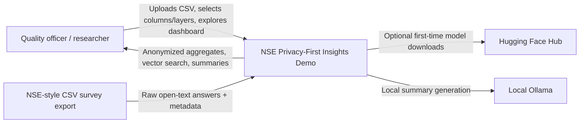
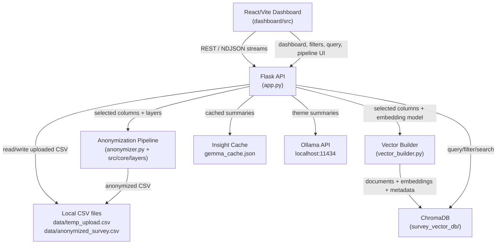
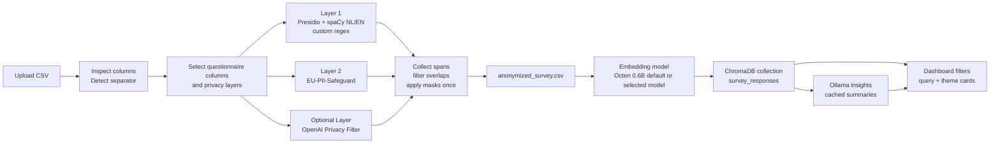

# NSE Privacy-First Insights Demo

This project is a local-first dashboard for turning open-text NSE-style survey answers into anonymized, searchable, and summarized insights.

The core idea is simple:

1. Upload a CSV with survey responses.
2. Select questionnaire columns.
3. Anonymize selected text using layered privacy filters.
4. Build a local Chroma vector database.
5. Generate/query insights with local models.

The project is built for demos and applied research, not production deployment.

## Quick Start

### Backend

```powershell
cd C:\fontys\semester_4\group\Demo
python -m venv .venv
.\.venv\Scripts\Activate.ps1
pip install -r requirements.txt
python app.py
```

Backend runs on `http://127.0.0.1:5001`.

### Frontend

```powershell
cd C:\fontys\semester_4\group\Demo\dashboard
npm install
npm run dev
```

Vite usually runs on `http://localhost:5173`.

## Environment

Create `.env` in the project root when you need Hugging Face downloads:

```env
HF_TOKEN=your_huggingface_token
```

`.env` is gitignored. Keep real tokens out of commits.

Useful optional variables:

```env
ANONYMIZE_BATCH_SIZE=512
LAYER2_FP16=1
DISABLE_SPACY_MODEL_AUTO_INSTALL=1
```

## C4 Model

### Level 1: System Context




### Level 2: Containers




### Level 3: Privacy And Insight Pipeline




## Current Data Flow

### 1. Upload and inspect

Endpoint: `POST /api/inspect-file`

- Saves upload to `data/temp_upload.csv`.
- Detects separator: comma, semicolon, or tab.
- Returns columns and a first-row preview.
- The frontend auto-selects questionnaire columns, including headers with:
  - `?`
  - `Wil jij...`
  - `Waarom...`
  - `Wat voor soort...`

### 2. Anonymize

Endpoint: `POST /api/anonymize`

Main files:

- `anonymizer.py`
- `src/core/layers/privacy_pipeline.py`
- `src/core/layers/layer1_presidio.py`
- `src/core/layers/layer2_eu_pii.py`
- `src/core/layers/layer2_openai_privacy_filter.py`

Current layer options:

- `presidio`: spaCy NL/EN + Presidio + custom recognizers.
- `eu-pii`: `tabularisai/eu-pii-safeguard`.
- `openai-privacy-filter`: experimental optional Hugging Face model.

Important behavior:

- Selected layers are preflighted before processing.
- If a selected model cannot load, the backend returns an error instead of silently skipping it.
- All layer spans are collected first, merged, filtered, then applied once. This avoids corrupting text with repeated regex replacements.
- Output is written to `data/anonymized_survey.csv`.

### 3. Build vectors

Endpoint: `POST /api/build-vectors`

Main file: `vector_builder.py`

- Reads `data/anonymized_survey.csv`.
- Detects CSV separator independently.
- Uses selected questionnaire columns.
- Stores documents, embeddings, and metadata in ChromaDB.
- Loads the embedding model before deleting/recreating the Chroma collection.
- Supports the configured Hugging Face/SentenceTransformer embedding models: `Octen/Octen-Embedding-0.6B` by default, `Octen/Octen-Embedding-4B`, and `Octen/Octen-Embedding-8B`.
- Stores the selected embedding model in Chroma metadata so queries and theme summaries use the same vector dimensions later.
- Supports `allow_model_download` from the frontend:
  - enabled: download model if missing.
  - disabled: only use locally cached models and fail before changing ChromaDB if unavailable.

Metadata is normalized to stable dashboard keys:

- `institution`
- `academic_year`
- `location`
- `programme`
- `study_mode`
- `cohort`

NSE/RIO aliases such as `Jaar`, `Leerroute_Track`, `Type Student`, and `Actuele naam instelling volgens RIO` are mapped into these keys.

### 4. Generate insights

Endpoints:

- `POST /api/precompute-insights`
- `POST /api/theme-summary`
- `POST /api/clear-cache`

Insights use local Ollama at `http://localhost:11434`.

Behavior:

- Ollama availability and selected model are checked before generation.
- If the model is missing, generation fails unless `Pull Ollama model if missing` is enabled in the UI.
- Chroma retrieves broad first-stage matches, then `zeroentropy/zerank-2-reranker` reranks the strongest candidates before the prompt is built.
- The dashboard sends up to 15 reranked answers to the LLM by default (`LLM_CONTEXT_DOCUMENTS=15`).
- Insight cache entries include `vector_relevant_count` and `llm_document_count` so you can see how many answers matched the theme and how many answers the LLM actually received.
- Successful summaries are cached in `gemma_cache.json`.
- Failed generations are not cached as successful insights.

### 5. Query and dashboard filters

Endpoints:

- `GET /api/filter-options`
- `GET /api/query-vectors`
- `GET /api/themes-overview`
- `GET /api/vector-stats`

Performance notes:

- `/api/themes-overview` caches filtered frequency results in memory.
- The backend reuses the theme embedding model and the seven theme embeddings.
- Restarting Flask clears in-memory caches.
- Rebuilding vectors clears runtime caches.

## Key Files

```text
app.py                                      Flask API and orchestration
anonymizer.py                               CSV anonymization runner
vector_builder.py                           ChromaDB / embedding builder
src/core/layers/privacy_pipeline.py         Late-mask span pipeline
src/core/layers/layer1_presidio.py          Presidio + spaCy + custom regex
src/core/layers/layer2_eu_pii.py            EU-PII Hugging Face layer
src/core/layers/layer2_openai_privacy_filter.py
dashboard/src/pages/PipelineDemo.jsx        Pipeline UI shell
dashboard/src/components/AnonymizerTab.jsx  Upload, column and layer selection
dashboard/src/components/VectorDBBuilder.jsx
dashboard/src/components/InsightGenerator.jsx
dashboard/src/components/QueryTab.jsx
dashboard/src/pages/Overview.jsx            Dashboard filters and themes
```

## Generated Local Files

These are runtime artifacts and should not be committed:

```text
data/temp_upload.csv
data/anonymized_survey.csv
data/detected_sep.txt
survey_vector_db/
gemma_cache.json
__pycache__/
```

## Contributor Notes

- Keep code comments and README content in English.
- Keep decision logs and portfolio writing in Dutch if added outside this demo.
- Do not commit `.env`, generated CSVs, ChromaDB files, or model cache files.
- If you change the pipeline behavior, update this README and the presentation deck.
- If you add a new model-backed layer, add a preflight check so unavailable models fail clearly.
- If you change metadata handling, keep canonical dashboard keys stable: `institution`, `academic_year`, `location`, `programme`, `study_mode`, `cohort`.

## Common Issues

### Model downloads are slow

First runs may download Hugging Face or Ollama models. Add `HF_TOKEN` for better Hugging Face rate limits.

### Flask loads twice

Flask debug mode uses the reloader. This can load models twice and clear in-memory caches. Use:

```powershell
flask --app app run --port 5001 --no-reload
```

### Filters are empty

Rebuild the vector database after changing metadata mappings. Filter options come from Chroma metadata.

### Insight generation fails

Check Ollama:

```powershell
ollama list
ollama pull gemma4:e4b
```

Or enable `Pull Ollama model if missing` in the UI.
