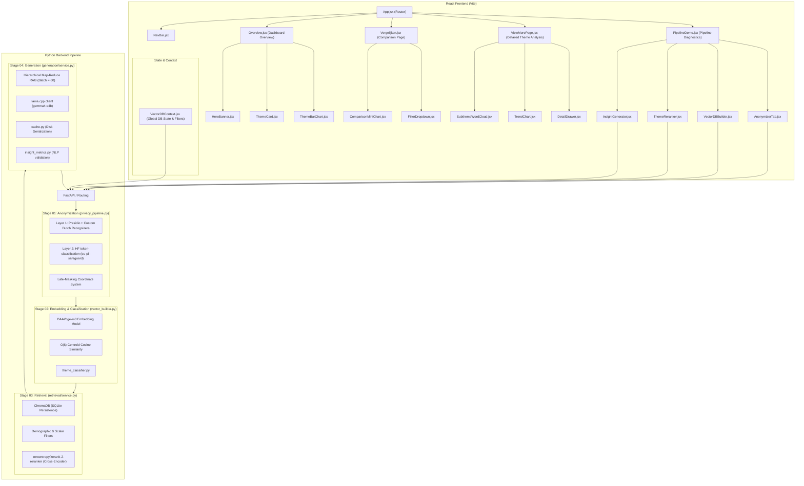

# System Handover & Technical Documentation

This document serves as the comprehensive technical handover guide for the Fontys survey analysis dashboard project. It outlines the architecture, pipeline steps, hardware deployment constraints, known limitations, and a direct roadmap for the next development team.

---

## 1. System Architecture & Tech Stack

The application follows a client-server architecture designed for local-first deployment, ensuring data privacy by performing all NLP and LLM tasks on local hardware.



### Frontend Technology Stack
- **Framework**: React (Vite-powered SPA bundle).
- **Styling**: TailwindCSS for component styling and responsive glassmorphism.
- **Routing**: `react-router-dom` using lazy-loaded code-splitting for performant page navigation.
- **Core Components**:
  - `Overview.jsx`: Main summary view exhibiting aggregate distributions and theme cards.
  - `Vergelijken.jsx`: Multi-dimensional demographic slice comparisons using interactive filtering.
  - `ViewMorePage.jsx`: Deep dive into specific themes, featuring token subtheme distribution charts, trend analyses, raw comment lists with highlighting, and a side detail drawer.
  - `PipelineDemo.jsx`: Control dashboard enabling users to trigger anonymization trials, vector indexing, reranking iterations, and LLM summary generation directly.

### Backend Pipeline Architecture
- **Framework**: Python 3.10+ modular backend pipeline containing four sequentially decoupled packages:
  - `01_anonymization`: Privacy sanitization wrapper.
  - `02_embedding`: Numerical vector construction and theme mapping.
  - `03_retrieval`: Filtered database querying and rank verification.
  - `04_generation`: Structured local LLM summarization.

### Vector Database
- **ChromaDB**: Persisted locally as a SQLite `.sqlite3` file structure (`survey_vector_db/`). Documents are cached alongside customized metadata dimensions to bypass indexing cycles on standard queries.

### Production Models
- **Embeddings**: `BAAI/bge-m3` (utilizing a local PyTorch `SentenceTransformer` runtime) to produce 1024-dimensional dense representations matching multilingual inputs.
- **Reranker (Optional)**: `zeroentropy/zerank-2-reranker` (Cross-Encoder) resolving boundary classification issues in ambiguous inputs.
- **Centroid Classification & Summarization**: `gemma4:e4b` (`unsloth/gemma-4-E4B-it-qat-GGUF:UD-Q4_K_XL` quant format) deployed via **llama.cpp** (`llama-server`) for fast, local structured completions.

---

## 2. Hardware & Deployment Advisory

To achieve privacy compliance, all inference runtimes are self-hosted on the host system. This local-only deployment introduces specific hardware runtime constraints.

> [!IMPORTANT]  
> **Minimum RAM Requirement: 16 GB**  
> Running the 4-B parameter LLM (`gemma-4-E4B-it-qat-GGUF`) locally alongside the spaCy NER engines and Hugging Face token classification pipeline requires a hard minimum of **16 GB RAM** (or unified memory on Apple Silicon).

### Deployment Model
- Deployed as a local **Server-Client architecture**.
- The backend starts a managed `llama-server` subprocess at `127.0.0.1:8080` with configurable options (context length, temperature, and GPU layer configuration).
- The React application communicates with python services using HTTP endpoints, and the python services proxy LLM generation tasks to `llama-server`.

### Hardware Safety Warning
> [!WARNING]  
> Do not attempt to run vector DB building and LLM summaries on standard, thin-and-light QA office laptops (e.g., standard Intel Core i5 with no dedicated graphics card and low cooling capacity). 
> - Sustained 100% CPU inference on non-workstation laptops will lead to severe **thermal throttling, application freezes, out-of-memory (OOM) kernel kills, or system crashes**.
> - Workstations equipped with modern dedicated GPUs (NVIDIA CUDA or AMD ROCm) or Apple Silicon devices (M-series Macs with unified memory) are strongly recommended for seamless performance.

---

## 3. The Data Pipeline (Step-by-Step)

The data flows through a strict, linear pipeline ensuring anonymization prior to vectorization and synthesis.

```
[Raw CSV] ──► [Multi-Layer Anonymizer] ──► [1-Cell to 1-Doc Ingestion] ──► [O(k) Centroid Cosine Sim] ──► [Hierarchical Map-Reduce RAG] ──► [JSON Dashboard Cache]
```

### Step 1: Anonymization (`privacy_pipeline.py`)
To prevent data leaks, the pipeline applies a multi-layered privacy approach before storing any texts.

1. **Layer 1 (Presidio)**: Microsoft Presidio is configured with spaCy model loaders (`nl_core_news_lg`, `en_core_web_lg`, and `de_core_news_lg`) alongside **custom regex and pattern recognizers** to identify Dutch educational and generic PII markers:
   - *Student Numbers*: Matches standard Dutch college IDs (`r"\b[0-9]{5,7}\b"`).
   - *Dutch BSN*: Ten-digit and dotted identification numbers.
   - *Dutch Postcodes & Mobile Phones*: Direct matching of standard formats.
   - *Teacher Name Context*: Special triggers identifying names following words like `Docent`, `Teacher`, `Mentor`, or `Professor`.
   - *Building & Floor Identifiers*: Detects references like `Room TQ 2.12` or `3e etage`.
2. **Layer 2 (Hugging Face / EU PII)**: TabularisAI's `eu-pii-safeguard` token classification model operates on CPU/GPU to capture complex European PII and medical descriptors.
3. **Late-Masking Coordinate System**: 
   - Traditional text anonymization uses sequential string replacement (regex-replacing substrings as they are found). However, this method shifts character indices, invalidating subsequent offsets and frequently causing text corruption (e.g., masking the middle of an already masked token like `[NAME]` into `[[NAME]]`).
   - The pipeline resolves this by collecting entity spans `(start_index, end_index, tag)` from all models in coordinate space. Spans are extended to cover Dutch possessives (e.g., `Janssen's` is normalized to catch the `'s` extension) and surrounding quotes in `extend_spans_for_original()`.
   - All spans are merged and deduplicated in index space.
   - The masking is applied **exactly once from right to left** (descending start indices) to preserve absolute document coordinate offsets.
4. **Carry-Forward Logic**: 
   - If a high-confidence personal name is detected (e.g., `"Mr. Hendriks"`), the exact string `"Hendriks"` is appended to a dynamic lookup map. 
   - The pipeline carries this name list forward, matching and masking sub-occurrences within that cohort block even if the name appears context-free later.

### Step 2: Ingestion & Vector Chunking Strategy
- **1-Cell to 1-Document Mapping**: The pipeline converts every cell of a text response column into an individual document in ChromaDB.
- **Why Semantic Chunking was Abandoned**:
  1. *Metadata Preserving*: Survey responses are accompanied by demographic and course-related metadata (academic year, location, programme, cohort). If a response was split into arbitrary semantic pieces, linking those pieces back to the original respondent's metadata would require complex overhead or duplicate storage.
  2. *Cohesion & Context*: Student feedback responses are already short (typically 1 to 3 sentences). Fragmenting them further leads to a loss of context.
  3. *Filtering Integrity*: Demographically sliced retrieval (e.g., "Show feedback from the Cohort 2024 VT at Eindhoven") works best when entire responses are returned as a single, coherent document.

### Step 3: Insight Generation & O(k) Clustering
Standard LLM-based categorization of $n$ feedback responses is computationally expensive, scaling at $O(n)$ where every response requires an LLM inference call. For a dataset of 10,000 documents, this process takes hours.

To bypass this bottleneck, the pipeline implements an **$O(k)$ Centroid-based Classification Approach**:
1. **Centroid Encoding**: During initialization, the pipeline embeds the structural descriptions of the $k$ target themes (defined in `src/config/themes.py`) using the embedding model to create a set of $k$ theme centroids in the vector space.
2. **Matrix Dot Product**: Instead of calling an LLM, the system performs a matrix multiplication of the document embeddings against the theme centroids ($O(k)$ vector operations). This maps each document to its closest candidate categories in milliseconds.
3. **Targeted Reranking**: The cross-encoder is only invoked for ambiguous items (where the distance margin between the top two candidate themes is less than `THEME_AMBIGUITY_SCORE_MARGIN`). The pipeline runs the reranker on just these $c$ candidates (where $c = 3$ by default) instead of the entire dataset. This hybrid approach drops overall computing time from **hours to minutes**.
4. **Hierarchical Map-Reduce RAG**:
   - To compile theme summaries, the backend reads all assigned documents (which can count in the hundreds or thousands).
   - Rather than overflowing the context window, the system groups documents into batches of `HIERARCHICAL_RAG_BATCH_DOCUMENTS` (default: `60`).
   - The local LLM processes each batch in parallel or quick sequence, extracting key concerns, subthemes, and student suggestions (the **Map** step).
   - A final **Reduce** prompt receives only the batch summaries and synthesizes them into the final JSON dashboard payload.

---

## 4. Technical Debt & Known Limitations

### Vector DB Scalability
- **ChromaDB as an MVP Decision**: ChromaDB was selected as a satisficing choice to meet the initial MVP deadline. It relies on a local SQLite file database to record metadata.
- **SQLite Performance Bottleneck**: Under load-testing at larger scales (exceeding **15,000 rows**), SQLite's write locking and file IO overhead can become a database bottleneck. 
- *Recommendation*: If scaling the survey population to hundreds of thousands of entries, ChromaDB should be migrated to a standalone client-server vector database such as **Qdrant** or **pgvector**.

### Redaction Aggressiveness
- **Over-Redaction of Educational Context**: The custom Dutch recognizers and Layer 2 models occasionally misclassify generic educational terms or codes as personal details.
- For example, terms like `"lokaal"`, mentor names, and course codes (e.g., `"R-1"`, `"TQ-A"`) might be aggressively replaced with generic tags like `[LOCATION]` or `[NAME]`, slightly reducing the readability of the student suggestion texts.
- *Recommendation*: Regularly tune the confidence thresholds (`PRESIDIO_MIN_SCORE` and `EU_PII_MIN_SCORE` in the environmental configurations) and update `_NAME_SPAN_STOPWORDS` within `privacy_pipeline.py` to prevent false positive matches.

---

## 5. Strategic Advice & Roadmap for the Next Team

The following priorities must be addressed to transition this MVP into a production-ready system.

### Architecture & Infrastructure
- **Database Migration**: Substantiate the use of ChromaDB + SQLite. For larger datasets, migrate to a scalable standalone client-server vector database such as **Qdrant** or **pgvector** to resolve SQLite write locking and performance bottlenecks.
- **Caching**: Replace the current JSON file storage with a robust, in-memory datastore like **Redis** to handle concurrent access and prevent cache timeouts.
- **Frontend Framework**: Transition from the current React SPA (Vite) to a Server-Side Rendered (SSR) framework like **Next.js** or **Remix** for better state management, server actions, and routing.
- **Containerization**: Implement **Docker** immediately. Provide a `docker-compose.yml` that spins up the frontend, backend API, and database services seamlessly.
- **Hosting Strategy**: Finalize the hosting environment early on. The available production hardware (e.g., GPU support, RAM size) will dictate whether you continue using `llama.cpp` or switch to a high-throughput engine like **vLLM**.

### AI Pipeline & Logic
- **Contextual Reranking**: The current reranker is too aggressive and strips out short answers (e.g., "Good", "Fine") because they lack theme context. **Fix**: Concatenate the original survey question to the short answer before passing it to the reranker/classifier.
- **Chunking Strategy Optimization**: Investigate optimized semantic/hierarchical chunking strategies to see if they can improve vector retrieval performance without losing crucial respondent metadata or short-answer context.
- **Sentiment Cross-Checking**: Validate open-ended text against closed-answer ratings. A comment like "Fine" on a question rated 1/10 is likely sarcastic. Use the quantitative score to weight the NLP classification (e.g., automatically tag open answers as negative if the associated closed ratings are 0 or 1).
- **System Prompts & Localization**: The LLM leans toward English outputs because the system prompt is in English. Translate the core system prompts to **Dutch** to properly handle and summarize Dutch student feedback.
- **Anonymization Tuning**: Revise the anonymization layer so it stops stripping critical educational context. Ensure labels, topics, and themes remain intact while masking actual PII.

### User Experience (UX) & Features
- **One-Click Processing**: Remove the manual pipeline configuration options and stages from the UI. The final application must be a clean "upload and click" experience without exposing technical pipeline settings to the end user.
- **Authentication**: Implement a secure login/authentication system. The current dashboard lacks necessary access controls.
- **Multilingual UI**: Add language toggles for the dashboard interface to support both **Dutch** and **English**.
- **Advanced Filtering**: Update the filter parameters to allow slicing by **Institute** rather than just by Study Program.
- **Historical Comparison**: Build a comparison view that allows administrators to compare historical data and trends year-over-year.
- **Actionable Insights**: Within the generated themes, explicitly prompt the LLM to output **Discussion Points** to spark dialogue between quality officers and students.

### Workflow & Maintenance
- **Code Cleanup**: Ruthlessly delete unused code, prototype scripts, and deprecated components to keep the repository maintainable.
- **End-User Validation**: Stop developing in a vacuum. Get the current build into the hands of actual quality officers and iterate based on their direct feedback.
