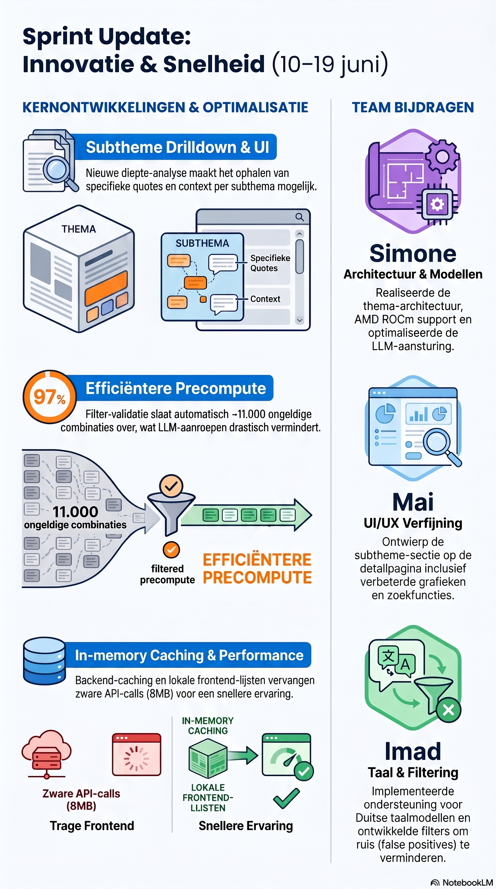

# Sprint update — Demo project (10–19 juni 2026)

Dit is een groepsproject. De commits in deze periode zijn afkomstig van nickvanhooff, ssimon003, maihere en iukocha. Dit document beschrijft het eigen werk van **nickvanhooff**, met vermelding waar teamleden aan hetzelfde onderdeel bijgedragen hebben.

---

## Eigen werk (nickvanhooff)

### Subtheme drilldown (10–18 juni)
Subthemes waren al zichtbaar als labels, maar er was geen manier om verder in te zoeken. Ik heb een drilldown-functie gebouwd waarmee per subtheme de bijbehorende quotes, aantallen en context op te halen zijn. Daarna heb ik subtheme-generatie gesplitst in een aparte precompute-stap, los van de hoofd-themes. Citaataantallen per subtheme worden nu ook meegenomen in de cache en de UI.

*ssimon003 heeft in dezelfde periode subtheme-bugs gefixed en de weergave verbeterd (`712e345`, `2f6d900`, `217d0e6`). maihere heeft de UI van de subtheme-sectie op de detailpagina aangepakt (`66d86c3`, `b5fc287`, `be687a5`).*

Relevante commits: `ad79eab`, `d3a5e9e`, `a6ddc4d`, `14c4447`

---

### Filtered precompute (12–13 juni)
De precompute ondersteuning voor gefilterde combinaties (bijv. per jaar, locatie, opleiding) ontbrak nog. Ik heb een filter-grid mechanisme gebouwd dat een cross-product van gekozen filterdimensies berekent en voor elke geldige combinatie insights genereert en cached.

*ssimon003 heeft de onderliggende theme-classificatie-architectuur gebouwd (`e31a24c`) waar dit op voortbouwt: persisted primary-theme assignments in ChromaDB metadata die het mogelijk maken filters snel toe te passen zonder het embedding-model opnieuw te laden.*

Relevante commits: `f23d039`, `fe52e9f`, `c7dedf6`

---

### In-memory caching (19 juni)
De Flask backend deed bij elke request opnieuw ChromaDB-queries voor data die zelden verandert (filter-opties, theme-overzicht, vector-statistieken, classificatie-metadata). Ik heb module-level in-memory caches toegevoegd voor al deze endpoints. De detailpagina (`ViewMorePage`) haalde bovendien de volledige theme-overzicht-payload op (~8 MB) terwijl het alleen de naam van het theme nodig had — vervangen door een lokale opzoeklijst in de frontend.

Relevante commits: `bed05d9`, `55b57b8`, `4a3e7ba`, `ec65178`, `4518232`

---

### Filter combo validatie (19 juni)
Het precompute-grid bevat combinaties die niet bestaan in de data (bijv. HBO-ICT in Rotterdam). Zonder validatie werden LLM-calls gedaan voor lege datasets. Ik heb `filter_valid_combos()` gebouwd: één ChromaDB bulk fetch, een omgekeerde index per dimensie, en Python set-intersection per combo. In de test-run: 10.988 van de ~11.259 combinaties overgeslagen. De precompute-preview geeft nu ook `valid_combos` terug zodat de UI het correcte aantal toont vóór de run start.

Gedocumenteerd in [`docs/filter-combo-validation.md`](filter-combo-validation.md).

*ssimon003 had eerder al een filterfix doorgevoerd aan de filterkant van de retrieval-service (`8c85b38`).*

Relevante commits: `8cb9a30`

---

### InsightGenerator UI & foutafhandeling (17 juni)
Cache-badges toegevoegd die per knop laten zien hoeveel entries al gecached zijn. Foutmeldingen verschijnen nu in de logstream. Automatische herverbinding toegevoegd: als de stream wegvalt (bijv. door een LLM-timeout) hervat de generator zelf zonder dat de gebruiker opnieuw hoeft te klikken.

*ssimon003 heeft in dezelfde week de beschikbare modellen bijgewerkt naar QAT + MTP varianten (`df06976`, `e2a6b1f`) en max_tokens/context_size aangepast (`088c6c4`).*

Relevante commits: `640c641`, `8775808`

---

### Bugfixes
- DonutChart toonde het totale aantal reacties van het hele theme als centrum-getal in plaats van het totaal van alleen de subtheme-quotes. Opgelost door `quote_count` te gebruiken. (`ec3f22b`)
- Filteropties tonen nu welke combinaties niet bestaan bij de actieve filter — onbeschikbare opties zijn zichtbaar maar uitgeschakeld. (`8cb9a30`)

---

## Bijdragen teamleden (10–19 juni)

| Persoon | Belangrijkste bijdragen |
|---------|------------------------|
| **ssimon003** | Persisted theme-classificatie-architectuur end-to-end (`e31a24c`), reranker batch processing + JSON parsing + memory optimalisatie (`3097a29`), Graphify-chart (`53d3ef0`), AMD ROCm support (`7f7da28`), LLM-model updates (QAT + MTP), systeem-prompt aanpassingen, diverse frontend fixes |
| **maihere** | Sub-theme UI op detailpagina (Top 3 layout, donut chart fixes, dropdown search) (`66d86c3`, `b5fc287`, `be687a5`) |
| **iukocha** | Duits taalmodel support, false positive reductie, custom woordfilter (`b394e86`) |

---

## Alle eigen commits (chronologisch)

| Datum | Commit | Omschrijving |
|-------|--------|--------------|
| 10 jun | `ad79eab` | Add subtheme drilldown functionality |
| 12 jun | `fe52e9f` | Sync insight generation, dashboard, settings |
| 13 jun | `f23d039` | Add filtered precompute for insights |
| 13 jun | `c7dedf6` | Fix progress bar and time estimate |
| 16 jun | `d3a5e9e` | Split subtheme generation into separate precompute step |
| 17 jun | `14c4447` | Enhance InsightGenerator and ViewMorePage with AI insights |
| 17 jun | `8775808` | Implement cache status feature in InsightGenerator |
| 17 jun | `640c641` | Improve InsightGenerator UI and error handling |
| 18 jun | `a6ddc4d` | Include quote counts for subthemes |
| 18 jun | `9642474` | Format ViewMorePage.jsx with consistent style |
| 18 jun | `46f3ab3` | Use quotes length and show count instead of icon |
| 19 jun | `bed05d9` | Add in-memory cache for generation files |
| 19 jun | `55b57b8` | Cache collection and classification metadata |
| 19 jun | `4a3e7ba` | Cache theme overview responses and filter options |
| 19 jun | `ec65178` | Cache vector stats and simplify React mount |
| 19 jun | `4518232` | Use local buildRealTheme instead of API fetch |
| 19 jun | `ec3f22b` | Use quote_count as DonutChart total |
| 19 jun | `8cb9a30` | Validate filter combos and show available options |
